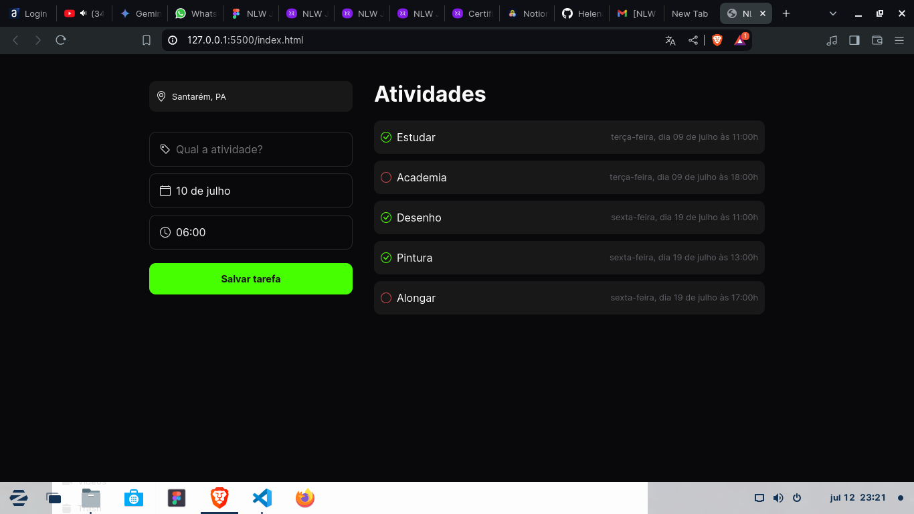

<h1>Planner</h1>

Planejador de atividades para o dia a dia

Acesse aqui: https://helenaoliveira366.github.io/NLW-Journey/
<h4>Tecnologias usadas: HTML, CSS e JS</h4>
<h4>Conceitos aplicados</h4>
<ul>
  <li>DayJS - Biblioteca de terceiros</li>
  <li>Object</li>
  <li>Array</li>
  <li>Functions e arrow functions</li>
  <li>For - estrutura de repetição</li>
  <li>If/else - Estrutura de decisão</li>
  <li>DOM</li>
  <li>Tags HTML</li>
  <li>Estilos CSS</li>
  <li>Responsividade</li>
  <li>Animação</li>
</ul>

